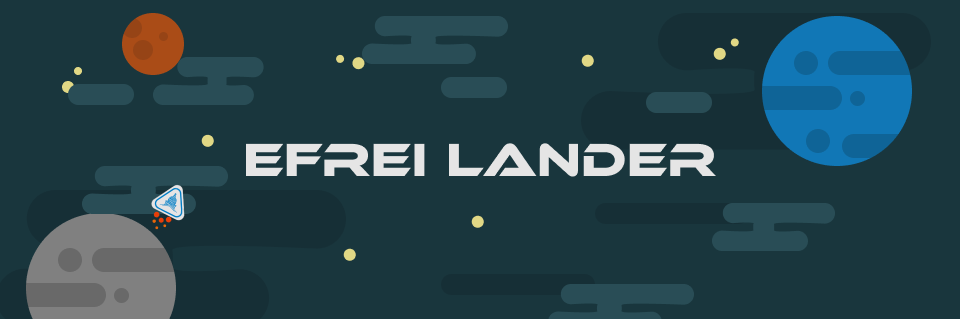

<div align="center">
    <h1> Efrei Lander </h1>




    

</div>

---

<div align="center">
    <h2> Projet de fin de semestre - Efrei Paris </h2>

## Cahier des charges

- [x] Équations de vaisseau en un point
- [x] Génération de map
- [x] Gestion des collisions
- [x] Gestion de la gravité
- [x] Gestion du fuel / vies / temps...
- [x] Explosion du vaisseau (éclats)
- [x] menu
- [x] Affichages
</div>

----

# Installation

Pour éxécuter le jeu, tapez ces commandes :

```pip install -r requirements.txt```

Puis

```python main.py``` to launch the game.

## Si vous avez une erreur liée à la police d'écriture au lancement :
supprimez puis réécrivez le `pygame.init()` dans le fichier `main.py`.